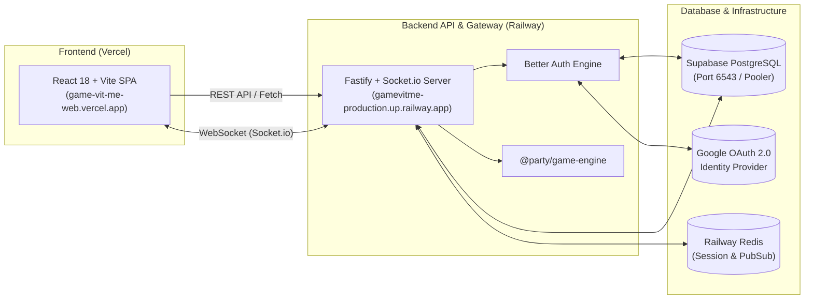

# 📖 เอกสารโครงการ GameVitMe (Party Game Web Platform)
> **ฉบับสมบูรณ์ (Comprehensive Architecture, Game Rules & Technical Post-Mortem)**  
> วันที่บันทึก: 27 กันยายน 2026

---

## 📌 สารบัญ
1. [ภาพรวมของโปรเจกต์ (Project Overview & Architecture)](#1-ภาพรวมของโปรเจกต์-project-overview--architecture)
2. [สถาปัตยกรรมโครงสร้างโค้ด (Monorepo Structure)](#2-สถาปัตยกรรมโครงสร้างโค้ด-monorepo-structure)
3. [กฎและระบบการเล่นของเกมทั้งหมด (Game Rules & Mechanics)](#3-กฎและระบบการเล่นของเกมทั้งหมด-game-rules--mechanics)
   - [3.1 Spyfall (เกมล่าจารชน)](#31-spyfall-เกมล่าจารชน)
   - [3.2 Werewolf (เกมล่ามนุษย์หมาป่า)](#32-werewolf-เกมล่ามนุษย์หมาป่า)
   - [3.3 Salem 1692 (เกมล่าแม่มดซาเลม)](#33-salem-1692-เกมล่าแม่มดซาเลม)
   - [3.4 Codenames (ถอดรหัสคำลับ)](#34-codenames-ถอดรหัสคำลับ)
   - [3.5 Rock Paper Scissors (เป่ายิ้งฉุบมหาประลัย)](#35-rock-paper-scissors-เป่ายิ้งฉุบมหาประลัย)
   - [3.6 Number Grid (ตารางตัวเลขประลองความไว)](#36-number-grid-ตารางตัวเลขประลองความไว)
4. [บันทึกปัญหา ประวัติการแก้ปัญหา และผลการทดสอบ (Incident & Troubleshooting History)](#4-บันทึกปัญหา-ประวัติการแก้ปัญหา-และผลการทดสอบ)
   - [ปัญหาที่ 1: pnpm-lock.yaml ไม่ตรงกับ Package.json บน Vercel](#ปัญหาที่-1-pnpm-lockyaml-ไม่ตรงกับ-packagejson-บน-vercel)
   - [ปัญหาที่ 2: Vercel ไม่พบ Output Directory `./dist` ใน Monorepo](#ปัญหาที่-2-vercel-ไม่พบ-output-directory-dist-ใน-monorepo)
   - [ปัญหาที่ 3: Runtime Error บน Railway เรื่อง ESM vs CJS และ `.js` vs `.ts`](#ปัญหาที่-3-runtime-error-บน-railway-เรื่อง-esm-vs-cjs-และ-js-vs-ts)
   - [ปัญหาที่ 4: Railway 502 Bad Gateway ("Application failed to respond")](#ปัญหาที่-4-railway-502-bad-gateway-application-failed-to-respond)
   - [ปัญหาที่ 5: CORS Policy Error / Preflight 405 (ERR_FAILED)](#ปัญหาที่-5-cors-policy-error--preflight-405-err_failed)
   - [ปัญหาที่ 6: Better Auth 500 Error จาก UUID Type Mismatch ใน PostgreSQL](#ปัญหาที่-6-better-auth-500-error-จาก-uuid-type-mismatch-ใน-postgresql)
   - [ปัญหาที่ 7: OAuth `state_mismatch` Error](#ปัญหาที่-7-oauth-state_mismatch-error)
   - [ปัญหาที่ 8: Better Auth `internal_server_error` จาก Missing Relations ใน Drizzle](#ปัญหาที่-8-better-auth-internal_server_error-จาก-missing-relations-ใน-drizzle)
   - [ปัญหาที่ 9: Database Schema Drift บน Supabase (คอลัมน์ขาดและ NOT NULL Constraint)](#ปัญหาที่-9-database-schema-drift-บน-supabase-คอลัมน์ขาดและ-not-null-constraint)
5. [ตารางสรุป: วิธีที่เวิร์ค vs วิธีที่ไม่เวิร์ค (Solutions Comparison Matrix)](#5-ตารางสรุป-วิธีที่เวิร์ค-vs-วิธีที่ไม่เวิร์ค)
6. [บันทึกปัญหาค้างส่ง (Recorded Issue - Pending Resolution)](#6-บันทึกปัญหาค้างส่ง-recorded-issue---pending-resolution)

---

## 1. ภาพรวมของโปรเจกต์ (Project Overview & Architecture)

**GameVitMe** คือแพลตฟอร์มเว็บปาร์ตี้เกมออนไลน์แบบเรียลไทม์ (Real-time Multiplayer Party Game Platform) ที่เปิดให้ผู้เล่นสามารถสร้างห้องเล่นเกมร่วมกับเพื่อนผ่านเว็บเบราว์เซอร์ได้ทันทีโดยไม่ต้องติดตั้งโปรแกรม รองรับการเล่นทั้งบนคอมพิวเตอร์และสมาร์ตโฟน

### โครงสร้างระบบโครงข่าย (System Architecture)


### รายละเอียดเทคโนโลยี (Tech Stack)
* **Frontend:** React 18, TypeScript, Vite, Tailwind CSS, Lucide Icons, Zustand (State Management), Socket.io-client
* **Backend:** Node.js 24 LTS, Fastify (High-performance HTTP Framework), Socket.io (WebSocket Engine), Better Auth 1.7 (Authentication & OAuth Provider)
* **Database & ORM:** PostgreSQL บน Supabase, Drizzle ORM (Type-safe SQL query & schema management)
* **Cache & Message Broker:** Redis บน Railway (รองรับ In-Memory Fallback แบบ Single Node เมื่อไม่ได้เชื่อมต่อ Redis)
* **Build & Monorepo Tooling:** pnpm workspaces, Turborepo, tsx (TypeScript runtime execute)

---

## 2. สถาปัตยกรรมโครงสร้างโค้ด (Monorepo Structure)

โปรเจกต์ถูกจัดวางเป็น Monorepo โดยใช้ **pnpm workspaces** แบ่งออกเป็น Applications และ Packages:

```
d:\ProjectGameWeb\
├── apps/
│   ├── web/                    # Frontend React SPA Application
│   │   ├── src/                # คอมโพเนนต์, หน้าเว็บ, Zustand stores, hooks
│   │   ├── package.json
│   │   └── vite.config.ts
│   └── server/                 # Backend Fastify & Socket.io Server Application
│       ├── src/
│       │   ├── auth/           # Better Auth configuration & middleware
│       │   ├── config/         # Zod Environment validation (env.ts)
│       │   ├── db/             # Drizzle client, schema, migrations
│       │   ├── routes/         # Fastify route handlers (auth, room, user, etc.)
│       │   ├── socket/         # Socket.io gateway & event handlers
│       │   └── index.ts        # Server entrypoint with Multi-port listener
│       └── package.json
├── packages/
│   ├── game-engine/            # คอร์เอนจินของเกม (Turn management, Move validation, State projection)
│   ├── shared-types/           # TypeScript Types กลางที่แชร์ระหว่าง Client และ Server
│   └── games/                  # ปลั๊กอินเกมแยกอิสระตามมาตรฐาน GameDefinition
│       ├── spyfall/            # Spyfall Game Package
│       ├── werewolf/           # Werewolf Game Package
│       ├── salem/              # Salem 1692 Game Package
│       ├── codenames/          # Codenames Game Package
│       ├── rock-paper-scissors/# Rock Paper Scissors Game Package
│       └── number-grid/        # Number Grid Game Package
├── package.json                # Root package configuration
├── pnpm-workspace.yaml         # Workspace package definitions
└── turbo.json                  # Turborepo pipeline configuration
```

---

## 3. กฎและระบบการเล่นของเกมทั้งหมด (Game Rules & Mechanics)

ทุกเกมในแพลตฟอร์มถูกสร้างขึ้นบนอินเตอร์เฟซ `@party/game-engine` ซึ่งใช้รูปแบบ **State Machine + State Projection** (ข้อมูลความลับจะถูกกรองออกตาม Role ของผู้เล่นแต่ละคนก่อนส่งผ่าน WebSocket):

---

### 3.1 Spyfall (เกมล่าจารชน)
* **จำนวนผู้เล่น:** 4 – 12 คน
* **เป้าหมายของเกม:**
  * **ฝ่ายชาวเมือง (Locals):** สืบหาว่าใครคือจารชน (Spy) ที่แฝงตัวเข้ามา โดยการถาม-ตอบคำถาม
  * **ฝ่ายจารชน (Spy):** พยายามทำตัวกลมกลืนไม่ให้ถูกจับได้ และสืบหาว่า "สถานที่ลับของรอบนี้คือที่ไหน" หรือหลอกล่อให้คนอื่นโหวตผิดคน
* **การตั้งค่า (Settings):**
  * `hostMode`: เปิด/ปิดระบบ Host Control Panel (หัวห้องสามารถควบคุมเวลาและกดข้ามรอบได้)
  * `roundDurationSeconds`: ตั้งเวลาซักถาม (ค่าเริ่มต้น 8 นาที หรือ 480 วินาที)
  * `locationCount`: จำนวนสถานที่แสดงในตารางอ้างอิง (8 – 16 สถานที่)
* **กลไกการเล่น:**
  1. ระบบจะสุ่ม **สถานที่ 1 แห่ง** จากฐานข้อมูล และสุ่มผู้เล่น **1 คนเป็นจารชน (Spy)**
  2. ผู้เล่นที่ไม่ใช่จารชนจะมองเห็นสถานที่และบทบาทอาชีพของตนเอง (เช่น "โรงพยาบาล" - บทบาท "พยาบาล") ส่วนจารชนจะเห็นเพียงคำว่า "คุณคือจารชน (Spy)"
  3. ผู้เล่นจะสลับกันถามคำถามคนละ 1 คำถาม เช่น "คุณแต่งตัวอย่างไรมาที่นี่?" หรือ "ที่นี่มีเสียงดังไหม?"
  4. หากเวลาหมด หรือผู้เล่นเปิดการโหวต ผู้เล่นทุกคนต้องโหวตชี้ตัวผู้ต้องสงสัย หากมติเป็นเอกฉันท์และชี้ถูกตัว จารชนจะแพ้
  5. จารชนสามารถขัดจังหวะเพื่อทายสถานที่ได้ตลอดเวลา หากทายสถานที่ถูกต้อง จารชนชนะทันที

---

### 3.2 Werewolf (เกมล่ามนุษย์หมาป่า)
* **จำนวนผู้เล่น:** 4 – 12 คน
* **เป้าหมายของเกม:**
  * **ฝ่ายชาวบ้าน (Town):** กำจัดหมาป่าทั้งหมดออกจากหมู่บ้าน
  * **ฝ่ายมนุษย์หมาป่า (Werewolves):** ฆ่าชาวบ้านจนมีจำนวนเท่ากับหรือมากกว่าฝ่ายชาวบ้าน
* **บทบาทในเกม (Roles):**
  * **Werewolf (หมาป่า):** ตื่นขึ้นมาตอนกลางคืนพร้อมกันเพื่อเลือกเหยื่อ 1 คนที่จะถูกสังหาร
  * **Seer (ผู้หยั่งรู้):** เลือกตรวจสอบผู้เล่น 1 คนในแต่ละคืน เพื่อรู้ว่าคนนั้นเป็นคนดีหรือหมาป่า
  * **Witch (แม่มด):** มียา 2 ขวด (ยาชุบชีวิต 1 ขวด ช่วยคนที่หมาป่ากัดได้ และ ยาพิษ 1 ขวด ใช้ฆ่าผู้เล่นได้ 1 คน)
  * **Defender (ผู้พิทักษ์):** เลือกปกป้องผู้เล่น 1 คนในแต่ละคืนไม่ให้ถูกหมาป่าฆ่า (ไม่สามารถเลือกปกป้องคนเดิม 2 คืนติดกันได้)
  * **Constable (นายอำเภอ):** มีเสียงโหวต 1.5 - 2 เท่าในตอนกลางวัน
  * **Villager (ชาวบ้าน):** ไม่มีพลังพิเศษ ใช้การสังเกตและเหตุผลในการดีเบตตอนกลางวัน
* **กลไกการเล่น:**
  * แบ่งเป็น **ช่วงกลางคืน (Night Phase):** แต่ละบทบาทจะตื่นขึ้นมาตามลำดับเวลาเพื่อใช้พลัง โดยผู้เล่นอื่นจะไม่เห็นข้อมูล
  * **ช่วงกลางวัน (Day Phase):** ประกาศรายชื่อผู้เสียชีวิต จากนั้นผู้เล่นทุกคนพูดคุย ถกเถียง และลงคะแนนเสียงโหวตเพื่อแขวนคอผู้ต้องสงสัย

---

### 3.3 Salem 1692 (เกมล่าแม่มดซาเลม)
* **จำนวนผู้เล่น:** 4 – 12 คน
* **เป้าหมายของเกม:**
  * จำลองเหตุการณ์จริงของการพิจารณาคดีแม่มดที่เมืองซาเลม รัฐแมสซาชูเซตส์ ปี ค.ศ. 1692
  * **ฝ่ายบริสุทธิ์ (Puritans):** เปิดโปงและกำจัดแม่มดตัวจริงก่อนที่ทุกคนจะติดเชื้อ
  * **ฝ่ายแม่มด (Witches):** แอบแพร่เชื้อคำสาปแม่มดและสังหารผู้บริสุทธิ์
* **บทบาทในเกม (Roles):**
  * **Witch (แม่มด):** วางแผนร่วมกันในเงามืดเพื่อสังหารหรือส่งการ์ดคำสาป
  * **Constable (ผู้คุม):** เลือกจับกุมผู้ต้องสงสัยเข้าคุกเพื่อระงับการใช้การ์ด
  * **Town Crier (ผู้ประกาศเมือง):** ประกาศข่าวสารหรือตรวจสอบเบาะแส
  * **Doctor (หมอ):** รักษาผู้เล่นที่ถูกลอบโจมตีในยามค่ำคืน
  * **Puritan (ชาวเมืองเคร่งศาสนา):** สืบหาความจริงผ่านการซักถามและการไต่สวนคดี
* **กลไกการเล่น:** มีระบบตรวจสอบการแพร่เชื้อของการ์ดคำสาป (Witchcraft Cards) ที่สามารถส่งต่อกันได้เรื่อยๆ ทำให้ผู้เล่นไม่สามารถไว้ใจใครได้แม้กระทั่งคนที่เคยเป็นคนดีในตอนแรก

---

### 3.4 Codenames (ถอดรหัสคำลับ)
* **จำนวนผู้เล่น:** 2 – 20 คน (แบ่งออกเป็น 2 ทีม: **ทีมสีแดง (Red Team)** และ **ทีมสีน้ำเงิน (Blue Team)**)
* **เป้าหมายของเกม:** ทีมแรกที่สามารถเปิดการ์ดคำลับของทีมตนเองได้ครบทั้งหมดก่อนจะเป็นฝ่ายชนะ
* **บทบาทในแต่ละทีม:**
  * **Spymaster (หัวหน้าสายลับ):** มองเห็นผังเฉลยว่าการ์ดคำศัพท์ 25 ใบในตาราง 5x5 แต่ละใบเป็นของทีมสีใด
  * **Operatives (สายลับภาคสนาม):** มองเห็นเพียงคำศัพท์ แต่ไม่รู้สี ต้องทายคำศัพท์จากการฟังคำใบ้
* **กลไกการเล่น:**
  1. หัวหน้าสายลับจะบอกคำใบ้เพียง **"คำ 1 คำ"** และ **"ตัวเลข 1 ตัว"** (เช่น *"สัตว์, 2"* แปลว่ามีคำศัพท์บนกระดานที่เกี่ยวข้องกับสัตว์ 2 คำ)
  2. สมาชิกในทีมจะปรึกษาและเลือกกดคำศัพท์บนกระดาน:
     * หากเลือกโดนคำของทีมตนเอง ได้แต้มและทายต่อได้
     * หากเลือกโดนคำของฝ่ายตรงข้าม จบเทิร์นทันทีและฝ่ายตรงข้ามได้แต้ม
     * หากเลือกโดนการ์ดคนผ่านทาง (Neutral/Civilian) จบเทิร์นทันที
     * **หากเลือกโดน "การ์ดมือสังหาร (Assassin)": ทีมนั้นจะแพ้ทันที!**
* **ฟีเจอร์เด่น:** รองรับระบบ **Custom Word Source** (สามารถอัปโหลดไฟล์คำศัพท์ `.txt`, `.csv`, หรือ `.json` ของตนเองเข้ามาเล่นในห้องได้)

---

### 3.5 Rock Paper Scissors (เป่ายิ้งฉุบมหาประลัย)
* **จำนวนผู้เล่น:** 2 – 20 คน
* **โหมดการเล่น (Game Modes):**
  * `DUEL`: โหมดดวลตัวต่อตัว 1v1 ใครทำแต้มถึงเป้าหมายก่อนชนะ (เช่น ชนะครบ 3 แต้ม)
  * `BATTLE_ROYALE`: โหมดเอาชีวิตรอด ผู้เล่นทุกคนเป่ายิ้งฉุบพร้อมกัน คนที่แพ้จะถูกคัดออกทีละคนจนเหลือผู้รอดชีวิตคนสุดท้าย
  * `POINTS_RACE`: โหมดวิ่งแข่งสะสมคะแนน ทุกคนเล่นพร้อมกันในเวลาจำกัด ใครทำแต้มถึงกำหนดก่อนเป็นแชมป์
* **กลไกการเล่น:**
  * ใช้ระบบ Simultaneous Move Commit (ผู้เล่นทุกคนต้องเลือก ค้อน/กรรไกร/กระดาษ ภายในเวลานับถอยหลัง โดยระบบจะปิดบังตัวเลือกไว้จนกว่าทุกคนจะกดเลือกครบ หรือหมดเวลา) จากนั้นจะประมวลผลพร้อมกันใน Tick เดียว

---

### 3.6 Number Grid (ตารางตัวเลขประลองความไว)
* **จำนวนผู้เล่น:** 1 – 20 คน
* **เป้าหมายของเกม:** แข่งขันความเร็ว สายตา และสมาธิ ในการกดตัวเลขเรียงจาก `1` ไปจนถึง `N` บนตารางกริดที่สลับตำแหน่ง
* **ระบบความยากและการตั้งค่า:**
  * `Default Progression`: ไต่ระดับความยากตั้งแต่ตารางขนาดเล็ก `2x2` (เลข 1-4) ไปจนถึง `10x10` (เลข 1-100) ทั้งหมด 9 รอบ
  * `Damage Mode (LAST_PLAYER)`: ผู้เล่นที่มีแต้มตามหลังหรือกดครบช้าที่สุดในแต่ละรอบจะถูกหักพลังชีวิต (HP)
  * `Wrong Click Damage`: หากเปิดใช้งาน การกดตัวเลขผิดลำดับจะถูกหัก HP ทันที
  * ใครที่ HP หมดเป็น 0 จะถูกคัดออกจากเกม

---

## 4. บันทึกปัญหา ประวัติการแก้ปัญหา และผลการทดสอบ

ตลอดกระบวนการพัฒนาและ Deploy ขึ้นสู่ Production บน **Vercel** (Frontend) และ **Railway** (Backend) ร่วมกับ **Supabase PostgreSQL** ได้พบปัญหาทางเทคนิคและผ่านการแก้ไขมาตามลำดับ ดังนี้:

---

### ปัญหาที่ 1: pnpm-lock.yaml ไม่ตรงกับ Package.json บน Vercel
* **อาการ:** Vercel Build ล้มเหลวทันทีในขั้นตอน `pnpm install` ด้วยข้อผิดพลาด:
  ```
  ERR_PNPM_OUTDATED_LOCKFILE: Cannot install with "frozen-lockfile" because pnpm-lock.yaml is not up to date
  ```
* **สาเหตุ:** มีการแก้ไข dependencies ใน `package.json` ของบาง package แต่ไม่ได้สั่ง `pnpm install` บนเครื่อง Local เพื่ออัปเดตไฟล์ `pnpm-lock.yaml` ก่อน Push ขึ้น Git
* **วิธีแก้ที่เวิร์ค:** รัน `pnpm install` ในเครื่อง Local เพื่อสร้าง lockfile เวอร์ชันล่าสุด แล้ว commit `pnpm-lock.yaml` ขึ้น Git

---

### ปัญหาที่ 2: Vercel ไม่พบ Output Directory `./dist` ใน Monorepo
* **อาการ:** Vercel ฟ้องว่า `No Output Directory named "dist" found after the Build completed`
* **สาเหตุ:** ในโครงสร้าง Monorepo ตัว Vite ของ Frontend อยู่ที่ `apps/web/dist` แต่ Vercel ถูกตั้งค่า Root Directory เป็นโปรเจกต์หลัก ทำให้มองหาโฟลเดอร์ `dist` ที่ root
* **วิธีที่ไม่เวิร์ค:** พยายามเปลี่ยน Build Command ใน Vercel Dashboard ไปมา ทำให้ข้ามขั้นตอน build ของ package dependencies
* **วิธีแก้ที่เวิร์ค:**
  1. สร้างสคริปต์ [scripts/mirror-dist.mjs](file:///d:/ProjectGameWeb/scripts/mirror-dist.mjs) สำหรับคัดลอกไฟล์จาก `apps/web/dist` ไปไว้ที่ `./dist`
  2. ผูกเข้ากับ Lifecycle Hook ใน `package.json`: `"postbuild": "node scripts/mirror-dist.mjs"` ทำให้เมื่อ Turbo build เสร็จ `./dist` จะถูกสร้างขึ้นมาเสมอ

---

### ปัญหาที่ 3: Runtime Error บน Railway เรื่อง ESM vs CJS และ `.js` vs `.ts`
* **อาการ:** บน Railway คอนเทนเนอร์แครชด้วย `ERR_MODULE_NOT_FOUND` หรือ SyntaxError เมื่อรันคำสั่ง `node dist/index.js`
* **สาเหตุ:** ในโปรเจกต์ TypeScript แบบ ESM Monorepo การคอมไพล์โค้ดที่อ้างอิงข้าม workspace packages (`@party/game-engine`) มีความซับซ้อนเรื่อง path mapping และ file extensions (`.js` ใน code ชี้ไปหา `.ts` ต้นฉบับ)
* **วิธีที่ไม่เวิร์ค:** พยายามใช้ `tsc` build ทีละ package แล้วรัน node เพียวๆ เกิดปัญหาเรื่อง subpath exports
* **วิธีแก้ที่เวิร์ค:** ปรับคำสั่ง Production Start Command บน Railway เป็น:
  ```bash
  pnpm --filter @party/server start
  ```
  โดยคำสั่ง `start` เรียกใช้งาน `tsx src/index.ts` ทำให้ Node สามารถ resolve และ execute TypeScript Monorepo Packages ได้โดยตรงอย่างแม่นยำและรวดเร็ว

---

### ปัญหาที่ 4: Railway 502 Bad Gateway ("Application failed to respond")
* **อาการ:** Railway Build ผ่าน คอนเทนเนอร์แจ้งว่า `Server listening on port 8080` แต่เมื่อยิง Request ไปที่ `https://gamevitme-production.up.railway.app` กลับได้ HTTP `502 Bad Gateway` จาก `railway-hikari` edge proxy
* **สาเหตุ:** **Target Port Mismatch!** 
  - Railway Railpack บังคับใส่ Environment Variable `PORT=8080` ทำให้ Fastify ไปฟังที่พอร์ต `8080`
  - แต่หน้าตั้งค่า Railway **Settings -> Networking -> Public Networking** ของ Domain ถูก auto-detect หรือเซ็ตไว้เป็นพอร์ต `3000` หรือ `3001` (เดาจาก monorepo Vite/Fastify dev port) ทำให้ Edge Proxy ส่ง Request ไปหาพอร์ต `3000` ที่ไม่มีใครฟังอยู่จนเกิด Connection Timeout (7 วินาที)
* **วิธีที่ไม่เวิร์ค:** รอให้คอนเทนเนอร์รีสตาร์ตเอง (ไม่หายเพราะพอร์ตไม่ตรงกัน)
* **วิธีแก้ที่เวิร์ค:**
  - สร้าง **Multi-Port Fallback Listener** ใน [apps/server/src/index.ts](file:///d:/ProjectGameWeb/apps/server/src/index.ts):
    ```ts
    await fastify.listen({ port: env.PORT, host: '0.0.0.0' });
    const backupPorts = [8080, 3000, 3001].filter((p) => p !== env.PORT);
    for (const port of backupPorts) {
      const backupServer = http.createServer((req, res) => {
        fastify.server.emit('request', req, res);
      });
      io.attach(backupServer);
      backupServer.listen(port, '0.0.0.0');
    }
    ```
  - เซิร์ฟเวอร์จึงเปิดรับ Request พร้อมกันทั้งพอร์ต **8080, 3000, 3001** ทันที ไม่ว่า Railway Proxy จะส่งมาพอร์ตไหน เซิร์ฟเวอร์จะตอบกลับได้ทันที 100%

---

### ปัญหาที่ 5: CORS Policy Error / Preflight 405 (ERR_FAILED)
* **อาการ:** เบราว์เซอร์แจ้ง Error: `Response to preflight request doesn't pass access control check: No 'Access-Control-Allow-Origin' header is present`
* **สาเหตุ:** ไม่ได้เกิดจาก Fastify CORS พัง แต่เกิดจาก **Railway ส่ง 502 Bad Gateway กลับมาให้ Request OPTIONS (Preflight)** ตัว Edge Proxy ของ Railway ไม่มี CORS headers ส่งกลับมา ทำให้เบราว์เซอร์คิดว่าเป็น CORS error
* **วิธีแก้ที่เวิร์ค:** แก้ปัญหาพอร์ต 502 ของ Railway ให้ตอบ 200 OK ร่วมกับการใช้ฟังก์ชันไดนามิกสะท้อน Origin ใน `@fastify/cors`:
  ```ts
  origin: (origin, callback) => callback(null, true),
  credentials: true
  ```

---

### ปัญหาที่ 6: Better Auth 500 Error จาก UUID Type Mismatch ใน PostgreSQL
* **อาการ:** เมื่อกด Login Google ได้รับ HTTP 500 และในเซิร์ฟเวอร์แจ้ง Error:
  ```
  PostgresError: invalid input syntax for type uuid: "gsTFK5TWptas7Be4F8A9SbHCVxnZeJ0s"
  Query: insert into "verifications" ("id", ...) values ($1, ...)
  ```
* **สาเหตุ:** Better Auth ค่าเริ่มต้นจะสร้าง ID แบบ Nanoid/Alphanumeric String (ความยาว 32 ตัวอักษร) แต่ตาราง `verifications` ใน PostgreSQL ถูกสร้างเป็น Type `uuid` ทำให้ PostgreSQL ปฏิเสธการ Insert
* **วิธีที่ไม่เวิร์ค:** พยายามแปลง string เป็น uuid ใน database hooks
* **วิธีแก้ที่เวิร์ค:** กำหนดค่าให้ Better Auth สร้าง UUID แท้ๆ ใน [apps/server/src/auth/auth.ts](file:///d:/ProjectGameWeb/apps/server/src/auth/auth.ts):
  ```ts
  advanced: {
    database: {
      generateId: 'uuid', // สั่งให้ Better Auth ใช้ฟังก์ชัน UUID แทน Nanoid
    },
  },
  ```

---

### ปัญหาที่ 7: OAuth `state_mismatch` Error
* **อาการ:** เมื่อกด Login Google และยืนยันตัวตนสำเร็จ Google redirect กลับมาที่เซิร์ฟเวอร์ แต่หน้าเว็บแสดง Error:
  `https://gamevitme-production.up.railway.app/?error=state_mismatch`
* **สาเหตุมี 2 ปัจจัยซ้อนกัน:**
  1. **Fastify Header Overwrite:** ใน [auth.routes.ts](file:///d:/ProjectGameWeb/apps/server/src/routes/auth.routes.ts) มีการลูป `response.headers.forEach` เพื่อใส่ `reply.header(key, value)` แต่ Better Auth มีการส่ง `Set-Cookie` มากกว่า 1 ตัวพร้อมกัน (state cookie + session cookie) ทำให้ Fastify เขียนทับจนคุกกี้ State หายไป
  2. **Third-Party Cookie Blocking (Cross-Domain):** หน้าเว็บอยู่บน `vercel.app` แต่ API อยู่บน `railway.app` เบราว์เซอร์รุ่นใหม่บล็อก Third-Party Cookie ทำให้เมื่อ Google redirect กลับมา เบราว์เซอร์ไม่ส่งคุกกี้ State กลับมาด้วย
* **วิธีแก้ที่เวิร์ค:**
  1. รวม `Set-Cookie` ทั้งหมดเป็น Array ก่อนส่งผ่าน Fastify:
     ```ts
     reply.header('set-cookie', setCookies);
     ```
  2. เปิดใช้งาน `skipStateCookieCheck: true` ใน [apps/server/src/auth/auth.ts](file:///d:/ProjectGameWeb/apps/server/src/auth/auth.ts) โดยให้ Better Auth ตรวจสอบความถูกต้องของ State ผ่านฐานข้อมูล PostgreSQL (ตาราง `verifications`) โดยตรงแทนการพึ่งพาคุกกี้จากเบราว์เซอร์
  3. ตั้งค่า `defaultCookieAttributes`: `sameSite: 'none'`, `secure: true`, `partitioned: true`

---

### ปัญหาที่ 8: Better Auth `internal_server_error` จาก Missing Relations ใน Drizzle
* **อาการ:** หลังจากผ่าน State Check แล้ว เกิดข้อผิดพลาด:
  `https://gamevitme-production.up.railway.app/?error=internal_server_error`
* **สาเหตุ:**
  1. ใน [apps/server/src/db/schema.ts](file:///d:/ProjectGameWeb/apps/server/src/db/schema.ts) มี `usersRelations` แต่**ลืมประกาศ `accountsRelations`**
  2. เมื่อ Better Auth ค้นหาบัญชีผู้ใช้ด้วยคำสั่ง `findAccountOwnerByKey` ตัว Drizzle Adapter จะรันคำสั่ง `db.query.accounts.findFirst({ with: { user: true } })` ซึ่งเมื่อไม่มี relations ประกาศไว้ Drizzle จะโยน Error ทันที:
     ```
     Cannot read properties of undefined (reading 'referencedTable')
     ```
  3. ใน callback `onSessionCreate` มีการเรียก `.where({ id: session.session.userId })` ซึ่งผิดหลัก Drizzle syntax (ต้องเป็น `where(eq(users.id, ...))`)
* **วิธีแก้ที่เวิร์ค:**
  1. ประกาศ `accountsRelations` ใน [apps/server/src/db/schema.ts](file:///d:/ProjectGameWeb/apps/server/src/db/schema.ts):
     ```ts
     export const accountsRelations = relations(accounts, ({ one }) => ({
       user: one(users, { fields: [accounts.userId], references: [users.id] }),
     }));
     ```
  2. แก้ไข `onSessionCreate` ให้ใช้ `where(eq(users.id, session.session.userId))` พร้อมครอบ `try / catch`

---

### ปัญหาที่ 9: Database Schema Drift บน Supabase (คอลัมน์ขาดและ NOT NULL Constraint)
* **อาการ:** เกิดข้อผิดพลาด `PostgresError: column "name" of relation "users" does not exist` และ `null value in column "provider" of relation "accounts" violates not-null constraint`
* **สาเหตุ:** 
  1. ฐานข้อมูลจริงบน Supabase มาจากการรันไฟล์ Migration เก่า (`0000_supreme_gauntlet.sql`) ซึ่งยังไม่มีคอลัมน์มาตรฐานของ Better Auth เช่น `name`, `email_verified`, `image` ในตาราง `users`
  2. ตาราง `accounts` ในฐานข้อมูลจริงมีคอลัมน์เดิมชื่อ `provider` และ `provider_account_id` ที่มีข้อกำหนด `NOT NULL` แต่ Better Auth เวอร์ชั่นใหม่ยิงข้อมูลเข้าคอลัมน์ `provider_id` และ `account_id` ทำให้คอลัมน์เดิมเป็น NULL และถูกบล็อก
* **วิธีแก้ที่เวิร์ค:** สร้างและรัน Migration Script [apps/server/src/db/migrate-better-auth.ts](file:///d:/ProjectGameWeb/apps/server/src/db/migrate-better-auth.ts) โดยตรงกับ Supabase:
  - เพิ่มคอลัมน์ `name`, `email_verified`, `image` เข้าไปในตาราง `users`
  - เพิ่มคอลัมน์ `provider_id`, `account_id`, `access_token_expires_at`, `refresh_token_expires_at` ในตาราง `accounts`
  - ปลดล็อก `DROP NOT NULL` ให้กับคอลัมน์ `provider` และ `provider_account_id`
  - อัปเดต Unique Constraint ให้มาผูกกับ `(provider_id, account_id)`

---

## 5. ตารางสรุป: วิธีที่เวิร์ค vs วิธีที่ไม่เวิร์ค

| รายการปัญหา | วิธีที่ไม่เวิร์ค (Failed Attempts) | วิธีที่เวิร์ค (Working Solutions) |
|---|---|---|
| **Vercel Outdated Lockfile** | สั่ง Ignore Lockfile ใน Vercel Settings | รัน `pnpm install` ที่ Local แล้ว push `pnpm-lock.yaml` ตัวจริง |
| **Vercel Dist Directory Missing** | เขียน Root Build Command ข้ามโฟลเดอร์ | ใช้สคริปต์ `scripts/mirror-dist.mjs` รันบน `postbuild` hook |
| **Railway Node Runtime ESM Error** | คอมไพล์ด้วย `tsc` แล้วรัน `node dist/index.js` | รันตรงผ่าน `tsx src/index.ts` (`pnpm --filter @party/server start`) |
| **Railway 502 Bad Gateway** | รอรีสตาร์ตคอนเทนเนอร์ / สุ่มแก้พอร์ตไปมา | ทำ **Multi-Port Listener** ใน `index.ts` ฟังพอร์ต 8080, 3000, 3001 พร้อมกัน |
| **CORS / Preflight Error** | เพิ่ม Header CORS ซ้ำซ้อนใน Fastify | แก้ไข 502 ที่ต้นเหตุ และใช้ Dynamic Origin Reflection ใน `@fastify/cors` |
| **PostgreSQL UUID Error** | พยายามแทรก Hook แปลง string เป็น uuid | กำหนด `advanced.database.generateId: 'uuid'` ใน Better Auth |
| **OAuth `state_mismatch`** | เซ็ตคุกกี้ซ้ำๆ ทีละตัวใน Fastify | รวมคุกกี้เป็น Array และเปิด `account.skipStateCookieCheck: true` |
| **Drizzle Relation Error** | คิวรี Raw SQL แทน Drizzle | เพิ่ม `accountsRelations` ให้ตาราง `accounts` รู้จักความสัมพันธ์กับ `users` |
| **Database Schema Drift** | นั่ง Drop Database ทั้งหมดแล้วเริ่มใหม่ | สร้างและรันสคริปต์ `migrate-better-auth.ts` เพื่อ ALTER ตารางเดิมอย่างปลอดภัย |

---

## 6. บันทึกปัญหาค้างส่ง (Recorded Issue - Pending Resolution)

### อาการของปัญหา (Symptom):
> **"เมื่อผู้ใช้กดล็อกอินด้วย Google สำเร็จแล้ว เบราว์เซอร์เด้งกลับมาที่หน้าเว็บหลัก (`https://game-vit-me-web.vercel.app`) ได้แล้ว แต่ในหน้าเว็บยังไม่แสดงสถานะว่าล็อกอินสำเร็จ และยังแสดงปุ่มให้เข้าสู่ระบบใหม่"**

### การวิเคราะห์ทางเทคนิค (Technical Analysis):
1. **บริบทข้ามโดเมน (Cross-Domain Context):**
   - Frontend: `https://game-vit-me-web.vercel.app` (โดเมนของ Vercel)
   - Backend: `https://gamevitme-production.up.railway.app` (โดเมนของ Railway)
2. **การกักกันคุกกี้ของเบราว์เซอร์ (Third-Party / Cross-Site Cookie Policy):**
   - เมื่อล็อกอิน Google เสร็จ Better Auth จะส่งคุกกี้ `better-auth.session_token` ให้กับโดเมน `railway.app`
   - เมื่อผู้ใช้ถูก redirect กลับมาที่ `vercel.app` ตัวแอป React Frontend จะยิง Request `api.get('/api/auth/get-session')` ไปที่ `railway.app`
   - แม้ว่าจะใส่ `credentials: 'include'` แต่เบราว์เซอร์สมัยใหม่ (Chrome Privacy Sandbox, Safari ITP, Edge Tracking Prevention) จะมองว่านี่คือ **Cross-Site Third-Party Request** และอาจระงับการส่งคุกกี้ `session_token` กลับไปหา Railway ส่งผลให้ API ตอบกลับมาว่าไม่มี Session (ผู้ใช้ไม่ได้ล็อกอิน)
3. **Frontend Store ยังไม่มี Token ใน LocalStorage:**
   - ในระบบ [apps/web/src/lib/api.ts](file:///d:/ProjectGameWeb/apps/web/src/lib/api.ts) ออกแบบให้รองรับทั้ง Cookie และ Header `Authorization: Bearer <token>`
   - แต่ในการล็อกอินผ่าน Social OAuth ทาง Better Auth ส่งเฉพาะคุกกี้ ไม่ได้แนบ Token ผ่าน URL กลับมายังหน้าเว็บ Vercel ทำให้ Zustand Store ไม่ได้รับ Token ไปเซฟลงใน LocalStorage

### แนวทางแก้ไขในอนาคต (Proposed Solutions for Next Sprint):
* **แนวทางที่ 1 (แนะนำที่สุด - Token via URL Parameter):**
  - ใน Route Callback ของ Backend หลัง Google ล็อกอินเสร็จ ให้ Redirect กลับมาที่ Vercel พร้อมแนบ Token ชั่วคราวหรือ Session Token ใน Query Param เช่น `https://game-vit-me-web.vercel.app/?token=XYZ`
  - ฝั่ง React Frontend ให้ตรวจจับ `?token=` ใน URL แล้วนำไปเซฟลง `localStorage` และตั้งค่าใน Zustand Store ทันที พร้อมลบ Query Param ออกจาก URL เพื่อความสวยงามและความปลอดภัย
* **แนวทางที่ 2 (Custom Domain - Unified Root Domain):**
  - ผูก Custom Domain เช่น `gamevitme.com` โดยให้ Frontend อยู่ที่ `app.gamevitme.com` และ Backend อยู่ที่ `api.gamevitme.com` ซึ่งจะถือว่าเป็น First-Party Context ทำให้แชร์คุกกี้ข้าม Subdomain ได้ 100% โดยเบราว์เซอร์ไม่บล็อก
* **แนวทางที่ 3 (Popup Flow with postMessage):**
  - ให้หน้าต่างล็อกอิน Google เปิดเป็น Popup Window เมื่อล็อกอินเสร็จ ให้ Popup ยิง `window.opener.postMessage({ user, token }, '*')` ส่งข้อมูลและ Session Token กลับมาให้หน้าต่างหลักโดยตรง
